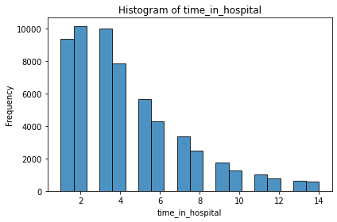
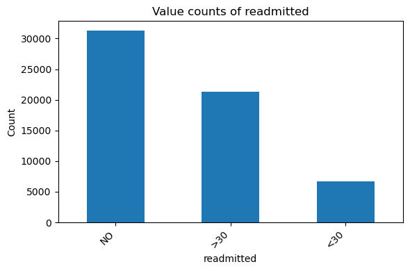
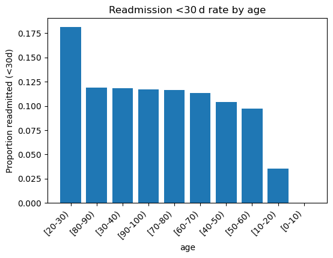
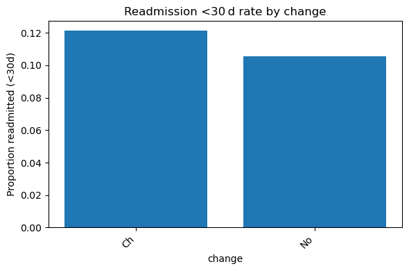
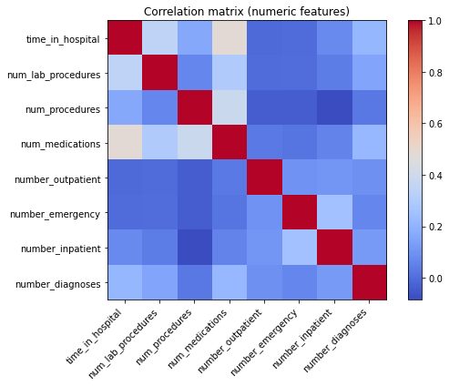
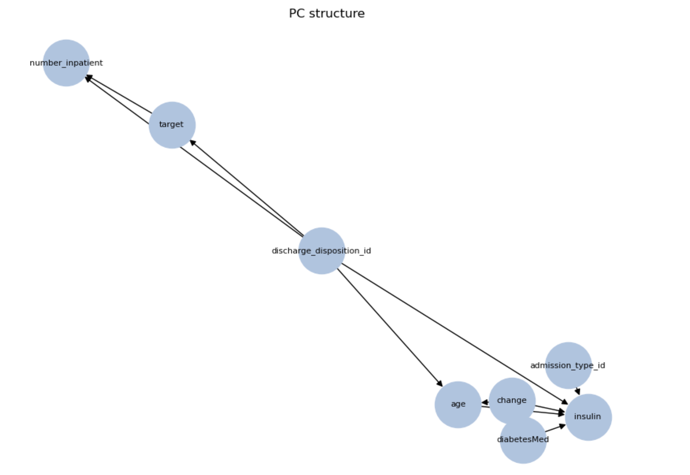
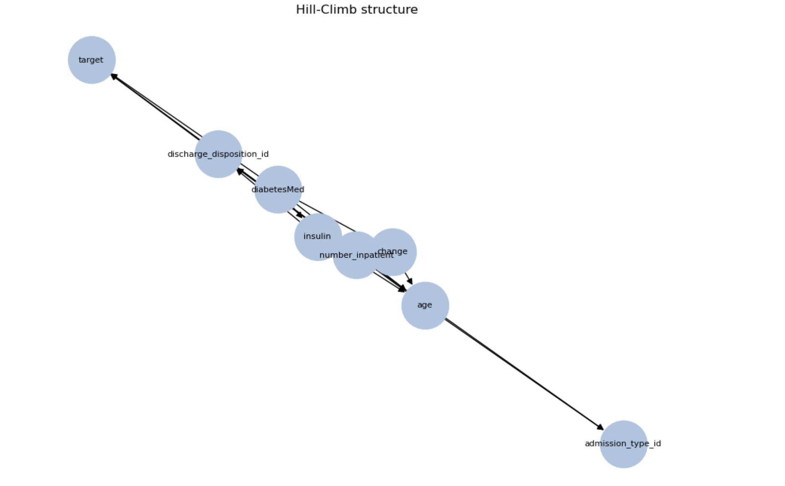
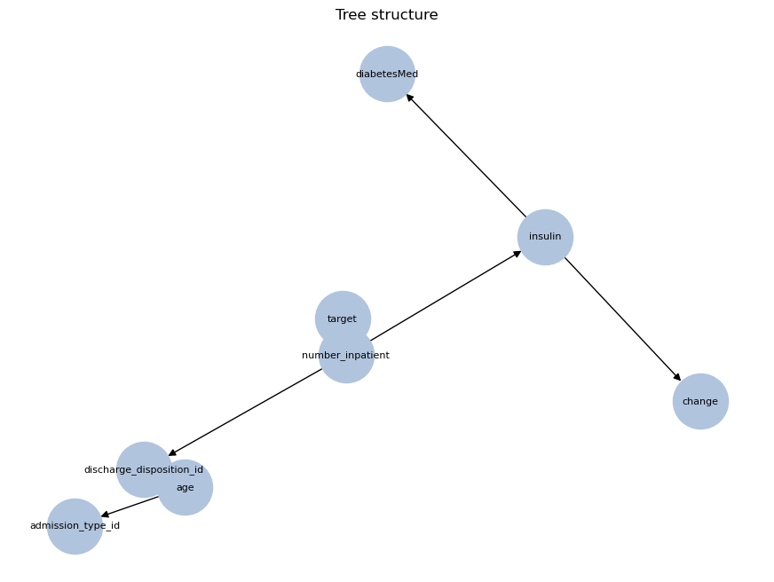

# 🫀 Heart‑Disease 30‑Day Readmission — Bayesian & ML Study  

Predicting early readmission for cardiac inpatients using an interpretable **Bayesian Network** and baseline machine‑learning models  
*(UCI “Diabetes 130‑US Hospitals 1999‑2008” dataset, filtered to ICD‑9 circulatory diagnoses)*  

---

## 1. Project Abstract
Early 30‑day readmission of heart‑disease patients drives cost and signals gaps in continuity of care.  
We build an interpretable **Bayesian Network** (BN) to capture probabilistic dependencies between demographics, utilisation variables, co‑morbidities and the binary `<30 d` readmission outcome, using the UCI *Diabetes 130‑US Hospitals* dataset (101 766 encounters).  
The workflow:

1. **Clinical filter** → retain only encounters with an ICD‑9 circulatory‑system diagnosis (390‑459, 785) → 59 313 rows.  
2. **Cleaning & EDA** → drop high‑missing columns, impute residual NaNs, visualise numeric and categorical distributions.  
3. **Models**:  
   * Bayesian Network (pgmpy) – hill‑climb + BIC structure, Bayesian parameter estimation.  
   * Logistic Regression – baseline calibration benchmark.  
   * XGBoost – strong non‑linear baseline.  
4. **Evaluation** – AUC, precision‑recall, Brier score & calibration curves.  

---

## 2. Dataset

| Item | Value |
|------|-------|
| Source | <https://archive.ics.uci.edu/dataset/296/diabetes+130-us+hospitals+for+years+1999-2008> |
| Raw size | 101 766 inpatient encounters, 50 columns |
| Heart‑disease subset | 59 313 rows after ICD‑9 390‑459 / 785 filter |
| Target | `readmitted = <30` (binary) |

---

## 3. Data‑Cleaning Pipeline

| Step | Action |
|------|--------|
| **Drop high‑missing columns** | `weight` (~97 %), `medical_specialty` (~49 %), `payer_code` (~40 %) |
| **Replace “?” → NaN** | normalise missing markers |
| **Impute** | diagnosis NaNs → `UnknownDiag`; other categoricals → mode |
| **Binary target** | `readmitted_binary = 1` if `<30`, else 0 |
| **Cardiac filter** | keep rows where any of `diag_1/2/3` ∈ 390‑459 or 785 |
| **Save** | `diabetic_heart_cleaned.csv` |

---

## 4. Key Exploratory Insights

### Length of Stay (LOS)
Most patients are discharged in under 6 days — right-skewed with a long tail to 14.



### Readmission Outcome Balance
About 37% of patients were readmitted within 30 days. The rest split into “NO” (52%) and “>30” (11%).



---

## Key Drivers of Readmission Risk

### Age
Younger patients (<50) have **higher** readmission rates — opposite of typical risk expectations.
Rates fall steadily with age (possible survivorship bias or different care pathways). Age buckets carry a clear monotonic trend—keep ordered encoding.



### Medication Change
Patients whose medication dosages were adjusted are more likely to return within 30 days.



---


## Correlation Matrix

The strongest correlation is `time_in_hospital` ↔ `num_medications` (ρ ≈ 0.45).  
No pair exceeds ρ = 0.7 → low multicollinearity, so we can retain all numeric features in logistic regression without severe variance inflation.



---


## 5. Modelling Road‑map

| Model | Library | Purpose |
|-------|---------|---------|
| **Bayesian Network** | `pgmpy` | Interpret joint dependencies & posterior probabilities |
| Logistic Regression | `scikit‑learn` | Linear baseline & calibration reference |
| XGBoost | `xgboost` | Non‑linear performance ceiling |

---
## Logistic Regression: Predicting 30-Day Readmission for Diabetic Patients

In this stage of the project, we implemented a logistic regression model to predict early 30-day hospital readmissions among diabetic patients using the UCI “Diabetes 130-US hospitals for years 1999–2008” dataset.

### Preprocessing and Pipeline
- Removed non-informative identifiers (`encounter_id`, `patient_nbr`)
- Separated features into categorical and numerical groups
- Applied one-hot encoding to categorical variables
- Built a pipeline using `scikit-learn` to handle preprocessing and modeling

### Class Imbalance Handling
- The dataset is highly imbalanced, with only about 11% of patients readmitted within 30 days
- To address this, we used `class_weight='balanced'` in logistic regression, which adjusts the loss function to penalize mistakes on the minority class more heavily

### Performance Metrics

| Metric                  | Value |
|-------------------------|-------|
| Accuracy                | 64%   |
| AUC (ROC)               | 0.631 |
| Precision (Readmitted)  | 0.17  |
| Recall (Readmitted)     | 0.55  |
| F1-score (Readmitted)   | 0.26  |

The model shows improved recall for readmitted patients, which is important in healthcare settings where failing to identify a high-risk patient can lead to costly outcomes. Performance was evaluated using ROC and Precision-Recall curves.

### Next Steps
- Benchmark against other classifiers such as XGBoost
- Explore resampling strategies (e.g., SMOTE, undersampling)
- Analyze feature importances and odds ratios for interpretability

## Bayesian-Network Classifier with **pgmpy**

---

### (1)&nbsp;&nbsp;Method overview
* **Dataset** UCI “Diabetes 130-US Hospitals 1999–2008” – 59 k encounters after cleaning  
* **Feature set** 14 high-signal columns (demographics, discharge context, prior utilisation, therapy flags)  
* **Numeric handling** `KBinsDiscretizer(n_bins = 3, strategy = "quantile")` → low / mid / high bins  
* **Structures compared**  
  1. **PC algorithm**   (constraint-based)  
  2. Hill-Climb + BIC   (max 3 parents)  
  3. Chow–Liu Tree      (root = `target`)  
* **Parameter fit** Bayesian Estimator (`prior_type="BDeu"`)  
* **Validation split** 80 / 20 train-test

---

### (2)&nbsp;&nbsp;Result sheet 1 – model selection

| Candidate | Validation BIC (↓) |
|-----------|-------------------:|
| **PC**           | **− 72 294.85** |
| Hill-Climb       | − 70 883.71 |
| Tree             | − 70 984.39 |

**PC is chosen** because it has the most-negative (best) BIC, i.e. the best
balance of goodness-of-fit and model simplicity.

---

### (3)&nbsp;&nbsp;Performance of the selected PC model

| Metric                    | PC Network | What it tells us                                                                                 |
| ------------------------- | ---------: | ------------------------------------------------------------------------------------------------ |
| **ROC-AUC (↑)**           | **0.595**  | ≈ 60 % chance the model ranks a readmitted patient above a non-readmitted one.                   |
| **Average Precision (↑)** | **0.143**  | Precision–recall summary for an imbalanced target (≈ 14 % baseline).                             |
| **Brier Score (↓)**       | **0.099**  | Calibration error; well below the 0.12–0.13 “coin-flip” region.                                  |

---

### (4)&nbsp;&nbsp;Graph comparison

| PC (best) | Hill-Climb | Tree |
|-----------|------------|---------------|
|  |  |  |

|                 | Key edges you can point out |
| --------------- | ---------------------------------------------------------------------------------------------------------------------------------- |
| **PC**          | `discharge_disposition_id → target` • `number_inpatient → target` • Therapy hub `diabetesMed → change → insulin`                     |
| **Hill-Climb**  | Denser; feedback chain age → insulin → change, but still funnels into `target` via discharge disposition.                            |
| **Tree**        | Strict Chow–Liu spanning tree; `insulin` drives `diabetesMed` and `change`, then links to `target` through `number_inpatient`.      |

**Recurring themes**

* Patients discharged **anywhere other than routine home** have far higher 30-day return risk.  
* **Frequent prior admissions** (“high utilizer” flag) are the second-strongest independent driver.

---

### (5)&nbsp;&nbsp;Best-model CPT excerpts (PC)

<details>
<summary><strong>Click to view the main conditional-probability tables</strong></summary>

```text
CPD of discharge_disposition_id
  (0) Routine home  → 0.618
  (1) SNF / Rehab   → 0.382
────────────────────────────────────────────────────────────
CPD of target | discharge_disposition_id
  disposition 0 → P(readmit)=0.063
  disposition 1 → P(readmit)=0.142
────────────────────────────────────────────────────────────
CPD of number_inpatient | disposition, target
  target=1 & dispo=1 → P(high bin) = 0.497
────────────────────────────────────────────────────────────
CPD of insulin | age, change, diabetesMed, admission_type_id, disposition
  Highest-risk parent combo → 0.590 “Up/Steady” insulin
... (see full notebook for complete tables)

```
</details>

**Interpreting the CPTs**
| #     | Node / CPT shown                         | Take-away                                                                                                  |
| ----- | ---------------------------------------- | ---------------------------------------------------------------------------------------------------------- |
| **1** | `discharge_disposition_id`               | 62 % routine home vs 38 % SNF/rehab/other.                                                                 |
| **2** | `insulin`                                | Dose level driven by admission type, age, med change, etc.; 59 % “Up/Steady” in highest-risk parent combo. |
| **3** | `age`                                    | Right-skewed; older bins dominate when meds are changed and disposition is non-routine.                    |
| **4** | `number_inpatient`                       | High-utiliser status ≈ 50 % when eventual readmission = 1.                                                 |
| **5** | `target`                                 | Readmit risk 14 % if disposition = SNF vs 6 % if routine home.                                             |
| **6** | `change`                                 | Med list changed in 58 % of encounters that have diabetes meds; almost never when no meds ordered.         |
| **7** | roots `admission_type_id`, `diabetesMed` | 53 % elective vs 47 % emergency; 77 % of stays involve diabetes meds.                                      |

Operational insights
- Post-acute planning (home supports vs rehab) is the highest-leverage intervention.
- Flag high-utiliser diabetics (≥ 1 prior admission) on day 1 and schedule enhanced follow-up.
- Medication intensification (change, insulin) acts as a mediator—useful for explanation, less for frontline triage thresholds.


---

## XGBoost Classifier with xgboost

---

 
 ### (1) Method overview
Dataset UCI “Diabetes 130-US Hospitals 1999–2008” – ~100k encounters after cleaning

Feature set All available structured variables (demographics, diagnoses, comorbidities, prior utilization, treatments, discharge details, after encoding/cleaning)

Categorical handling All string/categorical variables one-hot encoded; rare diagnosis codes grouped as “rare_diag”

Numeric handling Raw values retained (except grouping for rare/error codes)

Class imbalance Stratified train-test split, and threshold tuning for rare-event recall

Validation split 80 / 20 train-test (stratified on outcome)

Thresholding Default 0.5 and best‑F1 threshold both reported for interpretability


### (2) Result sheet 1 – model summary
| Parameter                        | Setting / Approach      |
| -------------------------------- | ----------------------- |
| **n\_estimators**                | 100                     |
| **max\_depth**                   | 5                       |
| **learning\_rate**               | 0.1                     |
| **subsample, colsample\_bytree** | 0.8, 0.8                |
| **random\_state**                | 42                      |
| **eval\_metric**                 | logloss                 |
| **Features**                     | All after preprocessing |


### (3) Performance of the XGBoost model
| Metric                                  |  XGBoost | What it tells us                                                                               |
| --------------------------------------- | -------: | ---------------------------------------------------------------------------------------------- |
| **ROC-AUC (↑)**                         | **0.66** | ≈ 66% chance the model ranks a readmitted patient above a non-readmitted one.                  |
| **Average Precision (↑)**               | **0.21** | Precision–recall summary for an imbalanced target (baseline ≈ 0.11).                           |
| **Accuracy (↑)**                        | **0.89** | Dominated by negatives; not a reliable summary for rare events.                                |
| **Recall (class 1, best F1 threshold)** | **0.52** | Model captures over half of true 30-day readmissions (with lower precision at this threshold). |
| **F1 (class 1, best F1 threshold)**     | **0.28** | Balanced score for rare event prediction at tuned threshold.                                   |


### (4) Threshold comparison
| Threshold      | Precision (1) | Recall (1) | F1 (1) | Accuracy |
| -------------- | ------------- | ---------- | ------ | -------- |
| Default (0.5)  | 0.60          | 0.01       | 0.03   | 0.89     |
| Best F1 (0.12) | 0.19          | 0.52       | 0.28   | 0.69     |


### (5) Feature importance and interpretation
| Feature                         |    Importance | What it suggests                                      |
| ------------------------------- | ------------: | ----------------------------------------------------- |
| **number\_inpatient**           |          High | Frequent prior admissions = higher readmission risk   |
| **discharge\_disposition\_id**  |          High | Non-routine discharge destinations raise risk         |
| **diag\_1 (primary diagnosis)** | Moderate/High | Underlying diagnosis matters for readmission          |
| **age**                         |      Moderate | Older age groups at higher risk                       |
| **insulin / therapy flags**     |      Moderate | Escalating or changing diabetes treatment is a marker |
| **number\_emergency**           |      Moderate | Prior ER visits = unstable disease                    |
| **change**                      |      Moderate | Medication changes = more complex or unstable cases   |

### (6) Interpretation and operational insights
At a recall-optimized threshold (0.12), the model identifies over half of all true 30-day readmissions, though at the cost of lower precision (increased false positives).

This makes XGBoost suitable as a frontline risk flagger or screening tool, with follow-up by clinicians to review flagged cases.

Discharge destination and prior utilization status are consistently the highest-leverage features for hospital intervention.

Performance is in line with published literature benchmarks for this outcome.


