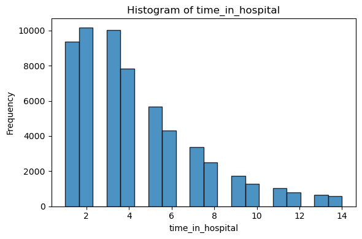

# 🫀 Heart‑Disease 30‑Day Readmission — Bayesian & ML Study  

Predicting early readmission for cardiac inpatients using an interpretable **Bayesian Network** and baseline machine‑learning models  
*(UCI “Diabetes 130‑US Hospitals 1999‑2008” dataset, filtered to ICD‑9 circulatory diagnoses)*  

---

## 1. Project Abstract
Early 30‑day readmission of heart‑disease patients drives cost and signals gaps in continuity of care.  
We build an interpretable **Bayesian Network** (BN) to capture probabilistic dependencies between demographics, utilisation variables, co‑morbidities and the binary `<30 d` readmission outcome, using the UCI *Diabetes 130‑US Hospitals* dataset (101 766 encounters).  
The workflow:

1. **Clinical filter** → retain only encounters with an ICD‑9 circulatory‑system diagnosis (390‑459, 785) → 59 313 rows.  
2. **Cleaning & EDA** → drop high‑missing columns, impute residual NaNs, visualise numeric and categorical distributions.  
3. **Models**:  
   * Bayesian Network (pgmpy) – hill‑climb + BIC structure, Bayesian parameter estimation.  
   * Logistic Regression – baseline calibration benchmark.  
   * XGBoost – strong non‑linear baseline.  
4. **Evaluation** – AUC, precision‑recall, Brier score & calibration curves.  

---

## 2. Dataset

| Item | Value |
|------|-------|
| Source | <https://archive.ics.uci.edu/dataset/296/diabetes+130-us+hospitals+for+years+1999-2008> |
| Raw size | 101 766 inpatient encounters, 50 columns |
| Heart‑disease subset | 59 313 rows after ICD‑9 390‑459 / 785 filter |
| Target | `readmitted = <30` (binary) |

---

## 3. Data‑Cleaning Pipeline

| Step | Action |
|------|--------|
| **Drop high‑missing columns** | `weight` (~97 %), `medical_specialty` (~49 %), `payer_code` (~40 %) |
| **Replace “?” → NaN** | normalise missing markers |
| **Impute** | diagnosis NaNs → `UnknownDiag`; other categoricals → mode |
| **Binary target** | `readmitted_binary = 1` if `<30`, else 0 |
| **Cardiac filter** | keep rows where any of `diag_1/2/3` ∈ 390‑459 or 785 |
| **Save** | `diabetic_heart_cleaned.csv` |

---

## 4. Key Exploratory Insights

### Length of Stay (LOS)
Most patients are discharged in under 6 days — right-skewed with a long tail to 14.

### Readmission Outcome Balance
About 37% of patients were readmitted within 30 days. The rest split into “NO” (52%) and “>30” (11%).

---

## Key Drivers of Readmission Risk

### Age
Younger patients (<50) have **higher** readmission rates — opposite of typical risk expectations.
Rates fall steadily with age (possible survivorship bias or different care pathways). Age buckets carry a clear monotonic trend—keep ordered encoding.

### Medication Change
Patients whose medication dosages were adjusted are more likely to return within 30 days.

---

## Correlation Matrix

The strongest correlation is `time_in_hospital` ↔ `num_medications` (ρ ≈ 0.45).  
No pair exceeds ρ = 0.7 → low multicollinearity, so we can retain all numeric features in logistic regression without severe variance inflation.

---

## 5  Modelling Road‑map

| Model | Library | Purpose |
|-------|---------|---------|
| **Bayesian Network** | `pgmpy` | Interpret joint dependencies & posterior probabilities |
| Logistic Regression | `scikit‑learn` | Linear baseline & calibration reference |
| XGBoost | `xgboost` | Non‑linear performance ceiling |

---

## **Bayesian-Network Classifier with `pgmpy`**
